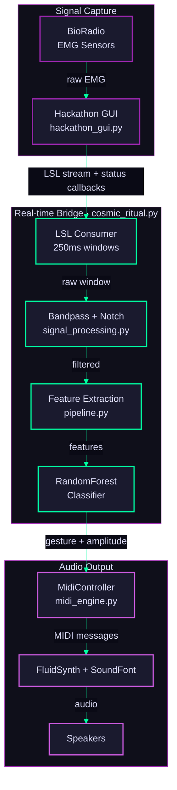
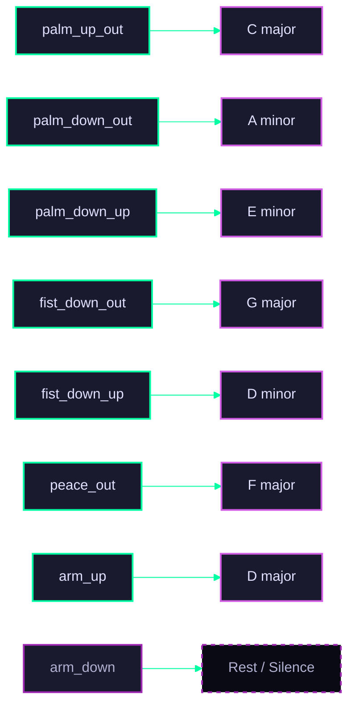
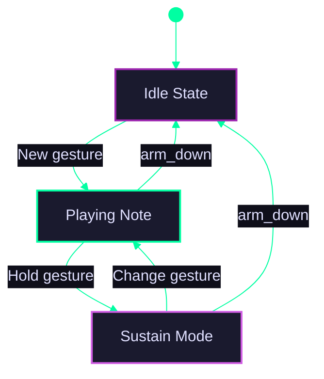

# :material-sitemap: Architecture

## System overview

---

## Signal flow

| Stage | File | What it does |
|-------|------|-------------|
| **Capture** | <nobr>`hackathon_gui.py`</nobr> | Streams raw EMG from BioRadio (serial), LSL, or mock source; records CSVs; hosts Music Mode toggle |
| **Real-time Bridge** | <nobr>`cosmic_ritual.py`</nobr> | Consumes LSL stream, windows data (250ms, 50% overlap), classifies gestures, and feeds the MIDI engine. Reports status back to the GUI via callbacks. Falls back to `SimpleFeatureClassifier` if the ML pipeline is unavailable. |
| **Preprocessing** | <nobr>`signal_processing.py`</nobr> | Bandpass filter (20-450 Hz) + 60 Hz notch filter |
| **Feature extraction** | <nobr>`pipeline.py`</nobr> | Sliding window: RMS, MAV, Variance, Waveform Length, Zero Crossings |
| **Classification** | <nobr>`pipeline.py`</nobr> | RandomForestClassifier trained on 8 gesture classes |
| **Music synthesis** | <nobr>`midi_engine.py`</nobr> | Maps gestures to chords/instruments; renders audio via FluidSynth (WASAPI/DirectSound/WaveOut) |

---

## Gesture mapping

### Right hand — chord selection

### Left hand — instrument selection

| Gesture | Instrument |
|---------|-----------|
| `fist_down_out` | Piano |
| `palm_up_out` | Nylon Guitar |
| `palm_down_out` | Steel Guitar |
| `palm_down_up` | Electric Guitar |
| `fist_down_up` | Strings |
| `peace_out` | Pad (Warm) |
| `arm_up` | Nylon Guitar |
| `arm_down` | Nylon Guitar |

---

## MIDI engine internals

The state machine debounces noisy classifier output (default: 3 consecutive frames) and handles chord transitions by triggering note-off before note-on. EMG amplitude maps to MIDI velocity (linear mapping from 0.0–1.0 to MIDI values 40–127).

During **sustain**, velocity updates dynamically — if the performer squeezes harder mid-chord, the held notes are re-voiced at the new velocity for real-time expression.

The engine automatically attempts to use the **WASAPI** driver for low latency on Windows, falling back to DirectSound or WaveOut if necessary.

---

## Key files

| File | Purpose |
|------|---------|
| <nobr>`src/midi_engine.py`</nobr> | MIDI engine: state machine, controller, playlist loader |
| <nobr>`src/cosmic_ritual.py`</nobr> | Real-time bridge: LSL stream to classifier to MIDI, with GUI status callbacks |
| <nobr>`src/midi_demo.py`</nobr> | Standalone demo: cycles instruments, chords, songs, and simulated classifier input |
| <nobr>`src/pipeline.py`</nobr> | ML pipeline: preprocessing, features, classifier |
| <nobr>`src/hackathon_gui.py`</nobr> | GUI: BioRadio/LSL/mock streaming, data recording, Music Mode toggle |
| <nobr>`src/signal_processing.py`</nobr> | Signal processing utilities (bandpass, notch filters) |
| <nobr>`playlist/*.json`</nobr> | Song chord progressions (6 songs) |
| <nobr>`soundfonts/GeneralUser_GS.sf2`</nobr> | SoundFont for FluidSynth (~30 MB, gitignored) |
