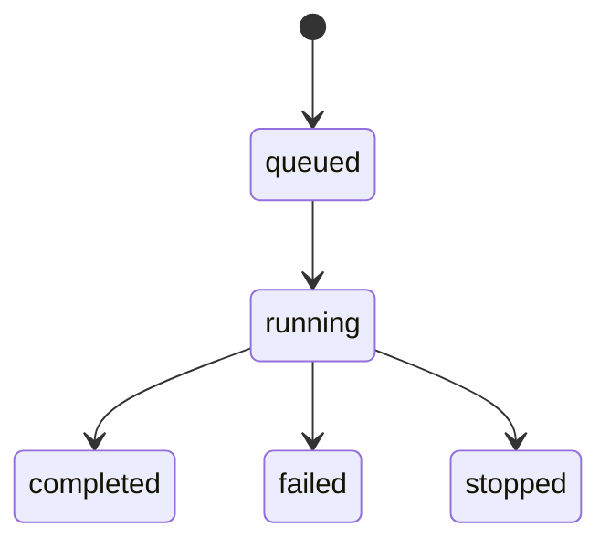

# :material-api: API Reference

The InteFL backend is a FastAPI application running on port `8000`. Start it with:

```bash title="Start the API server"
make dev
# or directly:
uvicorn intellifl.api.main:app --reload
```

!!! tip "Interactive docs"

    Swagger UI is available at `http://localhost:8000/docs` and ReDoc at `http://localhost:8000/redoc`.

---

## :material-play-network-outline: Simulations

### `GET /api/simulations`

List all simulations found in the `out/` directory.

**Response:** Array of simulation summary objects including `simulation_id`, `display_name`, `strategy_name`, `num_of_rounds`, `num_of_clients`, and `created_at`.

---

### `POST /api/simulations`

Launch a new simulation.

**Request body:** A strategy config JSON. Supports two formats:

*Single-sim (flat):*
```json title="Flat config"
{ "aggregation_strategy_keyword": "fedavg", "num_of_rounds": 10, "dataset_keyword": "femnist_iid" }
```

*Multi-sim (structured):*
```json title="Structured config"
{
  "shared_settings": { "num_of_rounds": 10, "dataset_keyword": "femnist_iid" },
  "simulation_strategies": [{ "aggregation_strategy_keyword": "fedavg" }]
}
```

**Response:** `{ "simulation_id": "api_run_<timestamp>" }`

Internally dispatches a Celery task (falls back to a subprocess if Redis is unavailable). The API returns immediately — poll `GET /api/simulations/{simulation_id}/status` or stream via `GET /api/simulations/{simulation_id}/stream` to track progress.

---

### `GET /api/simulations/{simulation_id}`

Get detailed information about a single simulation.

**Path parameters:**

| Parameter | Type | Description |
|---|---|---|
| `simulation_id` | `string` | Simulation directory name (e.g. `api_run_20240215_123456_789012`) |

**Response:** `config`, `result_files`, `status`, `progress`, `current_round`, `total_rounds`, `current_strategy`, `total_strategies`.

---

### `GET /api/simulations/{simulation_id}/config`

Get just the raw config JSON for a simulation.

---

### `GET /api/simulations/{simulation_id}/status`

Get the current execution status of a simulation.

**Response:** `SimulationStatusResponse` with `status`, `progress`, `current_round`, `total_rounds`, `current_strategy`, `total_strategies`, `error`.

---

### `GET /api/simulations/{simulation_id}/stream`

Stream simulation status **and** raw log output via Server-Sent Events.

Emits three event types:

| Event | Payload | Description |
|---|---|---|
| `status` | JSON status object | Sent whenever status changes |
| `output` | `{"text": "..."}` | New raw log output |
| `done` | (empty) | Sent when simulation reaches a terminal state |

Connect in JavaScript:

```javascript title="EventSource client"
const es = new EventSource(`/api/simulations/${simId}/stream`);
es.addEventListener('status', (e) => console.log(JSON.parse(e.data)));
es.addEventListener('output', (e) => console.log(JSON.parse(e.data).text));
```

---

### `GET /api/simulations/{simulation_id}/logs`

Stream structured, parsed log entries via Server-Sent Events.

Each `log` event contains `{ "timestamp": "...", "level": "INFO", "message": "..." }`.

---

### `GET /api/simulations/{simulation_id}/results/{result_filename}`

Serve a specific result file. Supported types: `.png`, `.pdf`, `.csv`, `.json`, `.html`, `.txt`.

Add `?download=true` for a CSV download (attachment) instead of JSON.

---

### `POST /api/simulations/{simulation_id}/stop`

Stop a running or queued simulation. Revokes the Celery task if queued; terminates the process tree if running.

---

### `PATCH /api/simulations/{simulation_id}/rename`

Update the display name of a simulation.

**Request body:** `{ "display_name": "My run" }` (max 100 characters)

---

### `DELETE /api/simulations/{simulation_id}`

Permanently delete a simulation and all its files.

---

### `DELETE /api/simulations`

Permanently delete multiple simulations.

**Request body:** `{ "simulation_ids": ["api_run_...", "api_run_..."] }`

---

## :material-check-decagram: Config Validation

### `POST /api/validate`

Validate a simulation configuration without creating a simulation.

**Request body:** Any config dict (same format as `POST /api/simulations`).

**Response:** `{ "valid": true }` or `{ "valid": false, "errors": ["field: message", ...] }`

---

## :material-format-list-numbered: Queue

### `GET /api/queue/status`

Get aggregate status counts for all simulations.

**Response:**

```json title="Queue status response"
{
  "queued": 1,
  "pending": 0,
  "running": 1,
  "completed": 5,
  "failed": 0,
  "stopped": 0,
  "total": 7,
  "is_empty": false
}
```

`is_empty` is `true` when no simulations are `queued` or `running`.

---

## :material-chart-line: Visualizations

Visualization endpoints live under the simulations namespace.

### `GET /api/simulations/{simulation_id}/plot-data`

Fetch the first `plot_data_*.json` file for a simulation.

**Response:** Plot data JSON as produced by the simulation runner.

---

### `GET /api/simulations/{simulation_id}/all-plot-data`

Fetch plot data for all strategies in a multi-strategy simulation.

**Response:** `{ "strategies": [{ "strategy_number": 0, "data": {...} }, ...] }`

---

### `GET /api/simulations/{simulation_id}/attack-snapshots`

Fetch attack snapshot metadata and visualization paths for a simulation.

**Response:** `{ "has_snapshots": true, "strategies": [...] }`

Each strategy entry contains a `summary` and a list of `snapshots` (per client per round), including paths to visual files (primary image, confusion matrix, heatmap, HTML diff, etc.).

---

## :material-database-search: Datasets

### `GET /api/datasets/validate`

Validate whether a HuggingFace dataset exists and is compatible.

**Query parameters:**

| Parameter | Description |
|---|---|
| `name` | HuggingFace dataset identifier, e.g. `ylecun/mnist` |

**Response:** `{ "valid": true, "compatible": true, "info": { "splits": [...], "num_examples": ..., "features": "...", "has_label": true, "key_features": [...] } }`

---

## :material-heart-pulse: System

### `GET /api/health`

Health check endpoint including Redis and Celery worker status.

**Response:**

```json title="Health response"
{
  "status": "healthy",
  "redis": "connected",
  "celery_workers": 1,
  "execution_mode": "celery"
}
```

`status` is `"healthy"` when Redis is reachable, otherwise `"degraded"` (simulations fall back to subprocess execution).

---

### `GET /api/system/devices`

Returns available training devices and GPU hardware information.

**Response:** `{ "available_devices": ["cpu", "gpu"], "gpu_available": true, "gpu_info": { "name": "...", "vram_gb": 8.0 }, "recommended_device": "gpu" }`

---

## :material-console: Terminal

### `WebSocket /api/terminal`

Opens an interactive pseudo-terminal (PTY) session over WebSocket.

The terminal runs a bash/cmd shell in the project root directory. Send text input as plain strings or a resize message to change the terminal dimensions:

```json title="Terminal resize message"
{ "type": "resize", "rows": 40, "cols": 120 }
```

This powers the in-browser terminal panel in the UI.

---

## :material-robot-outline: Agent

### `POST /api/agent/chat`

Send a chat message to the AI agent endpoint.

**Request body:**

```json title="Agent chat request"
{
  "messages": [
    { "role": "user", "content": [{ "type": "text", "text": "..." }] }
  ]
}
```

**Response:** `{ "message": "..." }`

---

## :material-state-machine: Status lifecycle

The `status` field follows this lifecycle:



| Status | Meaning |
|---|---|
| `queued` | Celery task dispatched, worker not yet picked it up |
| `pending` | Simulation directory created; runner has not yet written a status file |
| `running` | `simulation_runner.py` is actively executing |
| `completed` | All strategies finished successfully |
| `failed` | Process crashed or was interrupted |
| `stopped` | Manually stopped via `POST /api/simulations/{id}/stop` |

!!! info "Orphan recovery"

    After a server restart, the API startup hook automatically re-enqueues any simulations that were `queued` when the server shut down. Simulations that were `running` and whose process is now dead are marked `failed`.
