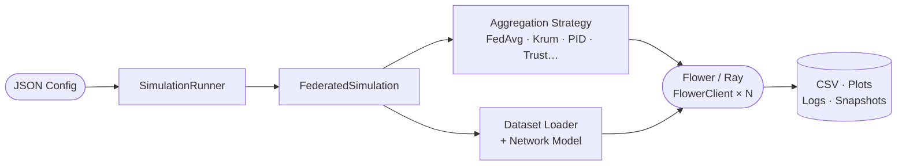

---
hide:
  - navigation
  - toc
---

# :material-scatter-plot: InteFL Docs

**A federated learning execution and research framework**
{ .hero-subtitle }

[:octicons-rocket-24: Get Started](getting-started.md){ .md-button .md-button--primary }
[:octicons-book-24: Architecture](architecture.md){ .md-button }

---

## :material-compass-outline: Explore the docs

-   :material-rocket-launch:{ .lg .middle } __Getting Started__

    ---

    Install with Docker or locally and run your first simulation in minutes

    [:octicons-arrow-right-24: Quick start](getting-started.md)

-   :material-sitemap:{ .lg .middle } __Architecture__

    ---

    How the API, Celery workers, Flower engine, and React UI fit together

    [:octicons-arrow-right-24: Explore](architecture.md)

-   :material-cog-outline:{ .lg .middle } __Configuration__

    ---

    Full `StrategyConfig` field reference — every knob you can turn

    [:octicons-arrow-right-24: Reference](configuration.md)

-   :material-database-outline:{ .lg .middle } __Datasets__

    ---

    FEMNIST, FLAIR, MedMNIST, CIFAR-100, HuggingFace text, and more

    [:octicons-arrow-right-24: Browse](datasets.md)

-   :material-shield-half-full:{ .lg .middle } __Strategies__

    ---

    FedAvg, Krum, Multi-Krum, Bulyan, RFA, PID, Trust, Trimmed Mean, ArKrum

    [:octicons-arrow-right-24: Compare](strategies.md)

-   :material-bug-outline:{ .lg .middle } __Attacks__

    ---

    Label flipping, backdoors, model poisoning, Byzantine perturbation, and more

    [:octicons-arrow-right-24: Details](attacks.md)

-   :material-api:{ .lg .middle } __API Reference__

    ---

    REST endpoints for launching, monitoring, and managing simulations

    [:octicons-arrow-right-24: Endpoints](api.md)

-   :material-monitor-dashboard:{ .lg .middle } __React Dashboard__

    ---

    Launch simulations, stream logs, and explore plots from the browser

    [:octicons-arrow-right-24: Get started](getting-started.md)

---

## :material-auto-fix: How it works

---

## :material-star-shooting: Key features

!!! tip "9+ Aggregation Strategies"

    FedAvg, Krum, Multi-Krum, Bulyan, RFA, Trimmed Mean, PID-based, Trust-based, ArKrum — each with configurable parameters

!!! danger "11 Attack Types"

    Label flipping, targeted label flipping, Gaussian noise, backdoor triggers, model poisoning, gradient scaling, boosted scaling, Byzantine perturbation, inner product manipulation, alternating min poisoning, token replacement

!!! info "Rich Dataset Support"

    FEMNIST, FLAIR, CIFAR-100, 11 MedMNIST subsets, Lung Cancer, plus HuggingFace text datasets (financial, legal, medical)

!!! success "Full-Stack Platform"

    REST API + React dashboard, Celery task queue, SSE live streaming, Docker Compose deployment, and this docs site — all included

---

## :material-layers-outline: Technology stack

| Layer | Technology |
|---|---|
| :material-flower-tulip: FL orchestration | [Flower (flwr)](https://flower.ai/) |
| :material-ray-start: Distributed compute | [Ray](https://www.ray.io/) |
| :material-fire: Deep learning | [PyTorch](https://pytorch.org/) |
| :fontawesome-solid-robot: LLM fine-tuning | [HuggingFace Transformers](https://huggingface.co/docs/transformers) + [PEFT/LoRA](https://huggingface.co/docs/peft) |
| :material-api: Backend API | [FastAPI](https://fastapi.tiangolo.com/) + [Uvicorn](https://www.uvicorn.org/) |
| :material-tray-full: Task queue | [Celery](https://docs.celeryq.dev/) + Redis |
| :material-react: Frontend | React + Vite |
| :material-web: Web server | nginx (production) / Vite dev server (development) |
| :material-book-open-variant: Documentation | [Zensical](https://zensical.org/) |
