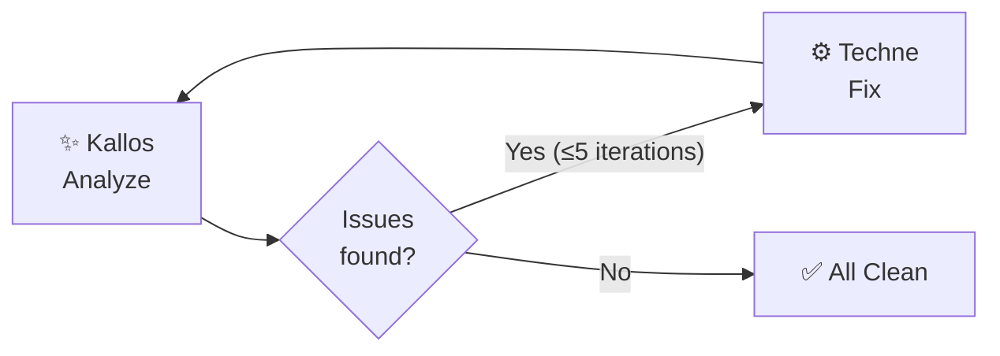

# Specialists

## 📐 Metis — Planner


**Port `10001`** · Model varies by [tier](../configuration.md#llm-models) (Opus on `smart`) · [`agents/metis/`](https://github.com/ajbarea/kourai_khryseai/tree/main/agents/metis)

Transforms rough ideas into detailed implementation specs. On the `smart` tier, uses the most capable model (Opus) because planning quality determines everything downstream.

**What it produces:**

1. **Summary** — One paragraph: what and why
2. **Files to Modify** — Existing files to edit (prefers editing over creating)
3. **Files to Create** — New files only when necessary
4. **Implementation Steps** — Numbered, specific, actionable
5. **Acceptance Criteria** — Testable conditions
6. **Edge Cases** — Potential problems
7. **Testing Notes** — Guidance for Dokimasia

**Context gathering:**

Before generating a spec, Metis runs shell commands to gather project context:

- `git status` + `git log --oneline -20` — Recent changes and current state
- Directory tree listing — Understanding the project structure

This context is injected into the LLM prompt so specs are grounded in the actual codebase, not generic.

**Files:**

| File | Purpose |
|---|---|
| `agent.py` | `get_project_context()`, `create_spec()`, `create_spec_stream()` |
| `agent_executor.py` | A2A bridge, context injection, OTEL spans |
| `__main__.py` | AgentCard, server startup |

---

## ⚙️ Techne — Coder


**Port `10002`** · Model varies by [tier](../configuration.md#llm-models) · [`agents/techne/`](https://github.com/ajbarea/kourai_khryseai/tree/main/agents/techne)

Implements code changes from specs or fix requests. Reads existing files first, understands patterns, then generates targeted edits.

**Capabilities:**

- **File reading** — Concurrently reads all files mentioned in the request using `asyncio.gather`
- **Git context** — Runs `git status` and `git diff` to understand the working tree
- **Path parsing** — Regex-based extraction of file paths from user input
- **Code generation** — LLM generates structured output with `ACTION`, `FILE`, `CONTENT` blocks
- **Path safety** — `validate_file_path()` ensures writes stay within the player's project root

**Output format:**

```
ACTION: CREATE
FILE: src/utils/parser.py
CONTENT:
def parse_csv(path: str) -> list[dict]:
    ...

ACTION: EDIT
FILE: src/api/endpoints.py
ORIGINAL:
def get_data():
    return json_response()
REPLACEMENT:
def get_data(format: str = "json"):
    if format == "csv":
        return csv_response()
    return json_response()
```

Supported actions: `CREATE`, `EDIT`, `DELETE`.

**Files:**

| File | Purpose |
|---|---|
| `agent.py` | File I/O, git context, `generate_code()`, path parsing |
| `agent_executor.py` | A2A bridge, ACTION/FILE/CONTENT parsing, file writes |
| `__main__.py` | AgentCard, server startup |

---

## 🧪 Dokimasia — Tester


**Port `10003`** · Model varies by [tier](../configuration.md#llm-models) · [`agents/dokimasia/`](https://github.com/ajbarea/kourai_khryseai/tree/main/agents/dokimasia)

Writes pytest test suites and runs them. Handles both test generation (LLM) and test execution (subprocess). Uses `run_fix_loop()` to iterate on failing tests up to 3 times before reporting.

**Two modes:**

1. **Generate tests** — LLM writes a pytest file based on the code and spec
2. **Run tests** — Executes `pytest` as a subprocess and parses structured results

**Test generation priorities:**

1. Unit tests (`tests/unit/`) — fast, isolated
2. Integration tests (`tests/integration/`) — external dependencies
3. Performance tests (`tests/performance/`) — timing

Target: **80%+ code coverage**.

**Files:**

| File | Purpose |
|---|---|
| `agent.py` | `run_pytest()`, `generate_tests()`, result parsing |
| `agent_executor.py` | Mode detection, fix loop, A2A bridge, OTEL spans |
| `__main__.py` | AgentCard, server startup |

---

## ✨ Kallos — Stylist


**Port `10004`** · Model varies by [tier](../configuration.md#llm-models) · [`agents/kallos/`](https://github.com/ajbarea/kourai_khryseai/tree/main/agents/kallos)

Runs linters, cleans up comments, and enforces the project's style guide. Uses `run_fix_loop()` for iterative fixing. Updates the `techne_v` virtue (+0.01 per clean pass).

**Two-stage analysis:**

1. **Subprocess** — Runs ruff check + format via `--output-format json`
2. **LLM** — Fixes lint issues and analyzes comments/docstrings against project standards

**Comment analysis rules:**

- Remove WHAT comments (`# Create the agent` — restates the code)
- Keep WHY comments (`# Cache to avoid recomputation per request`)
- Verify research citation accuracy
- Enforce modern type hints (Python 3.12+: `X | None`, lowercase `list`/`dict`)
- Google-style docstrings with Args/Returns

**Pipeline Feedback Loop:**

When Hephaestus detects that Kallos still found issues and Techne is in the pipeline, it automatically triggers broader fix iterations:



**Files:**

| File | Purpose |
|---|---|
| `agent.py` | `run_make_lint()`, `fix_lint_issues()`, `run_style_check()` |
| `agent_executor.py` | A2A bridge, fix loop, virtue updates, OTEL spans |
| `__main__.py` | AgentCard, server startup |

---

## 📜 Mneme — Scribe


**Port `10005`** · Model varies by [tier](../configuration.md#llm-models) · [`agents/mneme/`](https://github.com/ajbarea/kourai_khryseai/tree/main/agents/mneme)

Generates grouped commit messages from git diff output. Pure LLM, no subprocess or file I/O.

**Commit message format:**

```
type(scope): headline in present tense

- Past-tense bullet describing specific change
- Another change
Files: path/to/changed/file.py, path/to/other.py
```

**Enforced constraints:**

- Types: `test`, `docs`, `fix`, `feat`, `chore`, `refactor`, `perf`, `style`, `ci`, `build`
- Headlines in present tense ("add"), bullets in past tense ("added")
- No `.claude/` directory changes
- No marketing language ("robust", "comprehensive")
- **Never generates `git commit`, `git push`, or `git tag` commands** — committing is your job

**Files:**

| File | Purpose |
|---|---|
| `agent.py` | `generate_commit_messages()`, `generate_commit_messages_stream()` |
| `agent_executor.py` | A2A bridge, artifact emission, OTEL spans |
| `__main__.py` | AgentCard, server startup |

---

## 🎭 Puck — Companion Spirit


**Port `10006`** · Model varies by [tier](../configuration.md#llm-models) · [`agents/puck/`](https://github.com/ajbarea/kourai_khryseai/tree/main/agents/puck)

A mischievous daimon who guides the player experience. Not a development agent — Puck is a companion who provides tutorial guidance, nudges when idle, and facilitates relationship minigames. Always present.

**Three modes:**

1. **Tutorial** — First playthrough: introduces agents, explains affinity, walks through the forge
2. **Nudge** — Ongoing: prods when idle (15+ min), alerts on high jealousy (0.6+), hints at confession windows (0.9+ affinity)
3. **Minigame Facilitator** — Vulnerability moments, high-stakes conversations, confession scenes

**Personality:** Pragmatic, mischievous, warm. Not romanceable — strictly a companion.

**Files:**

| File | Purpose |
|---|---|
| `agent.py` | Mode detection, personality prompt with `personality_baseline` |
| `agent_executor.py` | A2A bridge, TextPart output |
| `__main__.py` | AgentCard, server startup |

---

## 💘 Cupid — Romance Spirit


**Port `10007`** · Model varies by [tier](../configuration.md#llm-models) · [`agents/cupid/`](https://github.com/ajbarea/kourai_khryseai/tree/main/agents/cupid)

An eros spirit who coaches the player through romantic progression with the maiden agents. Appears conditionally when affinity reaches 0.6+ with any agent. Builds relationship context from affinity scores.

**Capabilities:**

- Tracks player-agent affinity across all maidens
- Coaches confession timing and approach
- Mediates jealousy situations between agents
- Provides emotional context during vulnerability moments

**Personality:** Romantic idealist, emotionally intelligent, encouraging. Not romanceable.

**Files:**

| File | Purpose |
|---|---|
| `agent.py` | Relationship context building, personality prompt |
| `agent_executor.py` | A2A bridge, affinity context injection |
| `__main__.py` | AgentCard, server startup |

---

## 🪞 Aidos — Anti-Slop Validator


**Port `10008`** · Model varies by [tier](../configuration.md#llm-models) · [`agents/aidos/`](https://github.com/ajbarea/kourai_khryseai/tree/main/agents/aidos)

Detects and eliminates vague, corporate, and passive language from agent output. Uses regex pre-screening before LLM analysis for fast path on clean text.

**Pattern detection:**

| Category | Examples | Severity |
|---|---|---|
| Marketing words | "robust", "comprehensive", "seamless" | CRITICAL — auto-remove |
| Corporate patterns | "Emits structured artifacts", "downstream agents" | MEDIUM — suggest replacement |
| Vague adjectives | "sensible", "appropriate", "suitable" | LOW — flag |
| Passive patterns | "is used to", "is designed to", "can be" | LOW — flag |

**Philosophy:** Remove slop over explaining. Every description must answer "what does this actually do?" — not corporate speak.

**Output:** TextPart + DataPart with `{slop_words_found: int, clean: bool}`.

**Files:**

| File | Purpose |
|---|---|
| `agent.py` | Pattern lists, regex detection, LLM analysis |
| `agent_executor.py` | A2A bridge, structured artifact emission |
| `__main__.py` | AgentCard, server startup |

---

## 📚 Aletheia — Research Validator


**Port `10009`** · Model varies by [tier](../configuration.md#llm-models) · [`agents/aletheia/`](https://github.com/ajbarea/kourai_khryseai/tree/main/agents/aletheia)

Validates citations, claims, and factual assertions in agent output. Uses regex-based claim detection before LLM verification for efficient processing.

**Capabilities:**

- Detects factual claims in generated text
- Validates citations and references
- Checks technical accuracy of assertions
- Flags unverifiable claims for human review

**Output:** TextPart + DataPart with `{claims_found: int, verified: bool}`.

**Files:**

| File | Purpose |
|---|---|
| `agent.py` | Claim detection, citation validation, LLM verification |
| `agent_executor.py` | A2A bridge, structured artifact emission |
| `__main__.py` | AgentCard, server startup |
