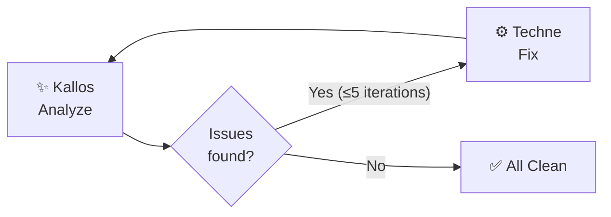

# Specialists

## 📐 Metis — Planner

**Port `10001`** · Model varies by [tier](../configuration.md#llm-models) (Opus on `smart`) · [`agents/metis/`](https://github.com/ajbarea/kourai_khryseai/tree/main/agents/metis)

Transforms rough ideas into detailed implementation specs. On the `smart` tier, uses the most capable model (Opus) because planning quality determines everything downstream.

**What it produces:**

1. **Summary** — One paragraph: what and why
2. **Files to Modify** — Existing files to edit (prefers editing over creating)
3. **Files to Create** — New files only when necessary
4. **Implementation Steps** — Numbered, specific, actionable
5. **Acceptance Criteria** — Testable conditions
6. **Edge Cases** — Potential problems
7. **Testing Notes** — Guidance for Dokimasia

**Context gathering:**

Before generating a spec, Metis runs shell commands to gather project context:

- `git status` + `git log --oneline -20` — Recent changes and current state
- Directory tree listing — Understanding the project structure

This context is injected into the LLM prompt so specs are grounded in the actual codebase, not generic.

**Files:**

| File | Purpose |
|---|---|
| `agent.py` | `get_project_context()`, `create_spec()`, `create_spec_stream()` |
| `agent_executor.py` | A2A bridge, context injection, OTEL spans |
| `__main__.py` | AgentCard, server startup |

---

## ⚙️ Techne — Coder

**Port `10002`** · Model varies by [tier](../configuration.md#llm-models) · [`agents/techne/`](https://github.com/ajbarea/kourai_khryseai/tree/main/agents/techne)

Implements code changes from specs or fix requests. Reads existing files first, understands patterns, then generates targeted edits.

**Capabilities:**

- **File reading** — Concurrently reads all files mentioned in the request using `asyncio.gather`
- **Git context** — Runs `git status` and `git diff` to understand the working tree
- **Path parsing** — Regex-based extraction of file paths from user input (supports `.py`, `.ts`, `.json`, `.yaml`, and many more extensions)
- **Code generation** — LLM generates structured output with `ACTION`, `FILE`, `CONTENT` blocks

**Output format:**

Techne's LLM produces structured responses that the executor parses:

```
ACTION: CREATE
FILE: src/utils/parser.py
CONTENT:
def parse_csv(path: str) -> list[dict]:
    ...

ACTION: EDIT
FILE: src/api/endpoints.py
ORIGINAL:
def get_data():
    return json_response()
REPLACEMENT:
def get_data(format: str = "json"):
    if format == "csv":
        return csv_response()
    return json_response()
```

Supported actions: `CREATE`, `EDIT`, `DELETE`.

**Files:**

| File | Purpose |
|---|---|
| `agent.py` | File I/O, git context, `generate_code()`, path parsing |
| `agent_executor.py` | A2A bridge, ACTION/FILE/CONTENT parsing, file writes |
| `__main__.py` | AgentCard, server startup |

---

## 🧪 Dokimasia — Tester

**Port `10003`** · Model varies by [tier](../configuration.md#llm-models) · [`agents/dokimasia/`](https://github.com/ajbarea/kourai_khryseai/tree/main/agents/dokimasia)

Writes pytest test suites and runs them. Handles both test generation (LLM) and test execution (subprocess).

**Two modes:**

1. **Generate tests** — LLM writes a pytest file based on the code and spec
2. **Run tests** — Executes `pytest` as a subprocess and parses structured results

**Test execution output:**

```python
@dataclass
class PytestRunResult:
    passed: int
    failed: int
    skipped: int
    errors: int
    total: int
    duration: float      # seconds
    output: str          # raw pytest output
    success: bool
```

**Test generation priorities:**

1. Unit tests (`tests/unit/`) — fast, isolated
2. Integration tests (`tests/integration/`) — external dependencies
3. Performance tests (`tests/performance/`) — timing

Target: **80%+ code coverage**.

**Files:**

| File | Purpose |
|---|---|
| `agent.py` | `run_pytest()`, `generate_tests()`, result parsing |
| `agent_executor.py` | Mode detection, A2A bridge, OTEL spans |
| `__main__.py` | AgentCard, server startup |

---

## ✨ Kallos — Stylist

**Port `10004`** · Model varies by [tier](../configuration.md#llm-models) · [`agents/kallos/`](https://github.com/ajbarea/kourai_khryseai/tree/main/agents/kallos)

Runs linters, cleans up comments, and enforces the project's style guide. Uses a lightweight model on `cheap`/`standard` tiers because most of its work is subprocess-based (ruff), with LLM only for comment analysis.

**Two-stage analysis:**

1. **Subprocess** — Runs `make lint` (ruff check + format) via `run_make_lint()`
2. **LLM** — Fixes lint issues and analyzes comments/docstrings against project standards

**Comment analysis rules:**

- Remove WHAT comments (`# Create the agent` — restates the code)
- Keep WHY comments (`# Cache to avoid recomputation per request`)
- Verify research citation accuracy
- Enforce modern type hints (Python 3.12+: `X | None`, lowercase `list`/`dict`)
- Google-style docstrings with Args/Returns

**Style report output:**

```python
@dataclass
class LintResult:
    tool: str
    passed: bool
    output: str
    fixed_count: int

@dataclass
class StyleReport:
    lint_results: list[LintResult]
    comment_analysis: str
    all_clean: bool
```

**Internal Fix Loop:**

Kallos actively attempts to fix linting and formatting issues herself using her LLM. To prevent getting stuck on stubborn errors, her internal execution loop defaults to a **maximum of 3 iterations** per run. If issues remain after 3 attempts, she reports them and completes her execution gracefully without crashing.

**Pipeline Feedback Loop:**

When Hephaestus detects that Kallos still found issues (after her internal loop) and Techne is in the pipeline, it automatically triggers broader fix iterations:



**Files:**

| File | Purpose |
|---|---|
| `agent.py` | `run_make_lint()`, `fix_lint_issues()`, `run_style_check()` |
| `agent_executor.py` | A2A bridge, report formatting, OTEL spans |
| `__main__.py` | AgentCard, server startup |

---

## 📜 Mneme — Scribe

**Port `10005`** · Model varies by [tier](../configuration.md#llm-models) · [`agents/mneme/`](https://github.com/ajbarea/kourai_khryseai/tree/main/agents/mneme)

Generates grouped commit messages from git diff output. The simplest agent — pure LLM, no subprocess or file I/O. Uses Haiku on `cheap`/`standard` tiers for speed.

**Commit message format:**

```
type(scope): headline in present tense

- Past-tense bullet describing specific change
- Another change
Files: path/to/changed/file.py, path/to/other.py
```

**Enforced constraints:**

- Types: `test`, `docs`, `fix`, `feat`, `chore`, `refactor`, `perf`, `style`, `ci`, `build`
- Headlines in present tense ("add"), bullets in past tense ("added")
- No `.claude/` directory changes
- No marketing language ("robust", "comprehensive")
- **Never generates `git commit`, `git push`, or `git tag` commands** — committing is your job

**Files:**

| File | Purpose |
|---|---|
| `agent.py` | `generate_commit_messages()`, `generate_commit_messages_stream()` |
| `agent_executor.py` | A2A bridge, artifact emission, OTEL spans |
| `__main__.py` | AgentCard, server startup |
