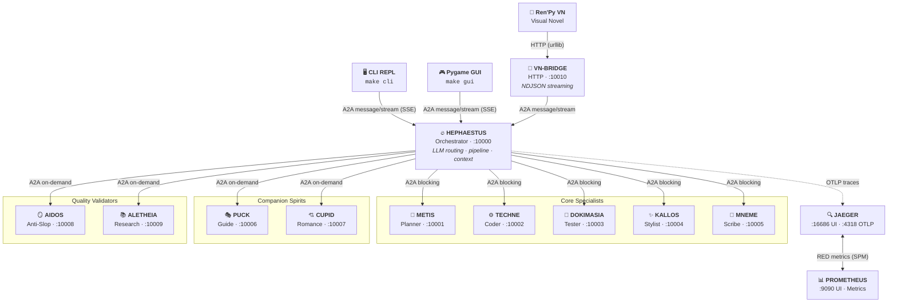

# Architecture

## 🎯 Design Principles

Kourai Khryseai is built around **transparency** and **interactivity**:

- **Specialization**: Each agent handles one discipline — planning, coding, testing, style, commits, companionship, romance, quality screening, or research validation. Specialists are focused and use appropriate model tiers.
- **Real-time feedback**: Agents stream their work as it happens. You don't wait for "final output"—you see reasoning in progress.
- **Human-on-the-loop**: When decisions matter (architecture choices, scope boundaries, validation rules), agents ask. You're never out of control.
- **Composable**: Agents are independent HTTP services. They can be deployed separately, tested independently, or replaced with custom implementations.
- **Observable**: Every request creates a distributed trace. See exactly what each agent did and how long it took.

---

## 🗺️ System Diagram



---

## 🔗 Communication Patterns

### User ↔ Hephaestus: Streaming (SSE)

All three hosts (CLI, Pygame GUI, Ren'Py VN) connect to Hephaestus using A2A `message/stream` with Server-Sent Events. This means you see real-time progress as each agent reports status — not a single response after everything finishes. The VN connects through a dedicated **vn-bridge** Docker service (`:10010`) that translates between HTTP/NDJSON and the A2A protocol. Ren'Py sends requests via `urllib` to the bridge, which streams A2A events from Hephaestus and returns them as newline-delimited JSON.

```python
# CLI sends a streaming request
request = SendStreamingMessageRequest(
    id=str(uuid4()),
    params=MessageSendParams(
        message=Message(
            role=Role.user,
            parts=[Part(root=TextPart(text=user_text))],
            context_id=context_id,
        ),
        configuration=MessageSendConfiguration(
            accepted_output_modes=["text"],
        ),
    ),
)

async for result in client.send_message_streaming(request):
    # TaskStatusUpdateEvent → progress messages
    # TaskArtifactUpdateEvent → final output
    ...
```

### Hephaestus ↔ Specialists: The Forge Transcript

Kourai Khryseai uses a **Human-on-the-Loop (HOTL)** architecture built around a shared **Forge Transcript**. Rather than passing each specialist only the previous agent's output, Hephaestus maintains a running dialogue log and broadcasts the **full transcript** to every specialist it calls.

The transcript grows with each step:

```
[User]: add user authentication
[Hephaestus]: Metis! Lay out the path. What does this forge need?
[Metis]: JWT with refresh token rotation, rate limiting on refresh...
[Hephaestus]: Well forged, Metis. Techne! Take what she's built and make it real.
[Techne]: Implementing src/auth/tokens.py and src/api/users.py...
```

This gives every agent full **group awareness** — Techne sees Metis's reasoning, Dokimasia sees what Techne actually wrote, Kallos sees the whole chain. No specialist works blind from a decontextualized stub.

Between every pipeline step, Hephaestus injects an **in-character narration line** (e.g., *"Dokimasia — put it through the fire."*) before calling the next specialist. These lines are streamed to the UI immediately so the forge feels alive during execution.

Execution remains sequential (Hephaestus awaits each specialist's final artifact before calling the next), but the _generation_ phase is entirely transparent — specialists stream their inner monologue in real-time via `AsyncGenerator` over A2A with `streaming=True`.

```python
# RemoteAgentConnection.send() — simplified
async for event in client.send_message(message):
    if isinstance(event, Message):
        yield ("result", extract_text(event))
    else:
        task, update = event
        if isinstance(update, TaskStatusUpdateEvent):
            yield ("status", extract_status(update))
```

### Direct Specialist Handoffs

Both the CLI and GUI support `@agent` mentions. A request starting with `@techne` bypasses Hephaestus's pipeline routing entirely, initiating a 1-on-1 conversation with that specialist directly.

### Input Required: Clarification Loop

When a specialist needs user input, it raises `AgentInputRequired`. Hephaestus catches this and yields an `INPUT_REQUIRED:` status. The CLI detects this state and prompts the user for follow-up, then resends to continue the pipeline.
