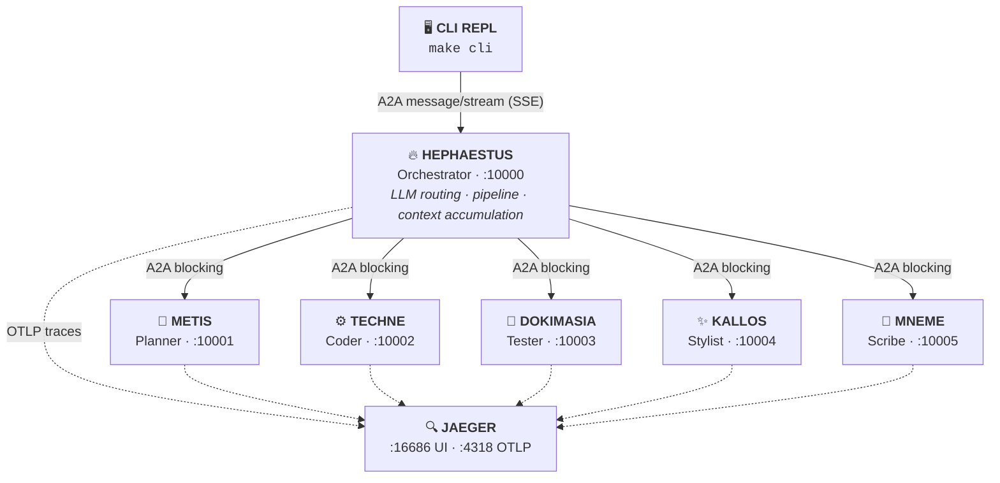

# Architecture

## 🗺️ System Diagram



---

## 🔗 Communication Patterns

### User ↔ Hephaestus: Streaming (SSE)

The CLI connects to Hephaestus using A2A `message/stream` with Server-Sent Events. This means you see real-time progress as each agent reports status — not a single response after everything finishes.

```python
# CLI sends a streaming request
request = SendStreamingMessageRequest(
    id=str(uuid4()),
    params=MessageSendParams(
        message=Message(
            role=Role.user,
            parts=[Part(root=TextPart(text=user_text))],
            context_id=context_id,
        ),
        configuration=MessageSendConfiguration(
            accepted_output_modes=["text"],
        ),
    ),
)

async for result in client.send_message_streaming(request):
    # TaskStatusUpdateEvent → progress messages
    # TaskArtifactUpdateEvent → final output
    ...
```

### Hephaestus ↔ Specialists: Asynchronous Streaming (HOTL)

Kourai Khryseai utilizes a **Human-on-the-Loop (HOTL)** architecture. Hephaestus calls specialists using an asynchronous `AsyncGenerator` wrapper over the A2A client with `streaming=True`. 

This enables specialists to actively stream their "inner monologues" (e.g., `⚙️ Coding: def parse_ast(node)...`) to Hephaestus, which immediately pipes them back to the GUI. The execution of the pipeline remains sequential (Hephaestus waits for Techne's final artifact before calling Dokimasia), but the _generation_ phase is entirely transparent.

```python
# RemoteAgentConnection.send() — simplified
async for event in client.send_message(message):
    if isinstance(event, Message):
        yield ("result", extract_text(event))
    else:
        task, update = event
        if isinstance(update, TaskStatusUpdateEvent):
            yield ("status", extract_status(update))
```

### Direct Specialist Handoffs

To facilitate true conversational interaction, the GUI supports `@agent` mentions. A request starting with `@techne` will bypass Hephaestus's normal pipeline routing logic entirely, instantly initiating a 1-on-1 pipeline with that agent.

### Input Required: Clarification Loop

When a specialist needs user input, it raises `AgentInputRequired`. Hephaestus catches this and yields an `INPUT_REQUIRED:` status. The CLI detects this state and prompts the user for follow-up, then resends to continue the pipeline.
