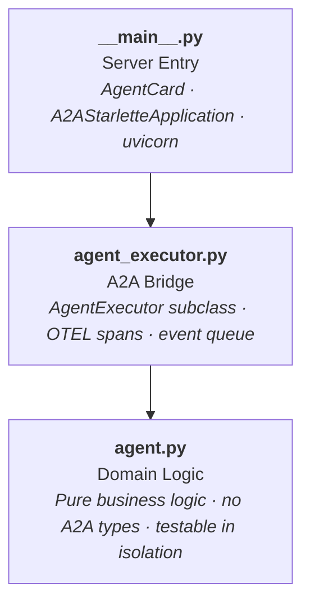

# Internals

## 🏗️ Three-Layer Agent Pattern

Every agent follows the same internal structure. No exceptions.



| Layer | File | Responsibility |
|---|---|---|
| **Server entry** | `__main__.py` | Defines the `AgentCard`, creates the `A2AStarletteApplication`, starts uvicorn. |
| **A2A bridge** | `agent_executor.py` | Subclasses `AgentExecutor` from `a2a-sdk`. Translates between A2A events and domain logic. Creates OTEL spans. |
| **Domain logic** | `agent.py` | Pure business logic. No A2A types. Async functions and generators. Testable in isolation. |

**Why this matters:**

- `agent.py` never imports `a2a.*` — you can test all business logic with simple function calls and mocked LLM responses
- `agent_executor.py` is the only file that touches A2A types — protocol changes are contained to one layer
- `__main__.py` owns configuration — if you need to change ports, skills, or card metadata, it's all in one place

### Example: Mneme's Three Layers

```python title="agents/mneme/agent.py — pure logic, no A2A"
async def generate_commit_messages(git_output: str, context_id: str | None = None) -> str:
    messages = [
        {"role": "system", "content": get_enriched_system_prompt(SYSTEM_PROMPT, "mneme")},
        {"role": "user", "content": f"Generate commit message groups for these changes:\n\n```\n{git_output}\n```"},
    ]
    return await chat("mneme", messages, temperature=0.2, max_tokens=2048, context_id=context_id)  # (1)!
```

1. `chat()` from `kourai_common.llm` — handles model selection, timeouts, and retries automatically.

```python title="agents/mneme/agent_executor.py — A2A bridge"
class MnemeAgentExecutor(BaseAgentExecutor):  # (1)!
    @executor_error_handler(agent_name="mneme")
    async def execute(self, context: RequestContext, event_queue: EventQueue) -> None:
        await super().execute(context, event_queue)

    async def execute_agent_logic(self, context, task, updater) -> None:
        user_input = context.get_user_input()
        await send_working_status(updater, task, "Analyzing git changes...", emoji="📜")
        full_response = ""
        async for chunk in generate_commit_messages_stream(user_input):
            full_response += chunk
        await updater.add_artifact([Part(root=TextPart(text=full_response))])
        await updater.complete()
```

1. `BaseAgentExecutor` from `kourai_common.base_executor` — handles task creation, input validation, and common setup. Subclasses override `execute_agent_logic()`.

```python title="agents/mneme/__main__.py — server config"
agent_card = AgentCard(
    name="Mneme — Scribe",
    description="Commit message specialist. Analyzes git diffs and generates grouped commit messages.",
    url=get_agent_url(AGENT_NAME),
    version="0.1.0",
    skills=[skill],
    capabilities=AgentCapabilities(streaming=True),
    ...
)
request_handler = DefaultRequestHandler(
    agent_executor=MnemeAgentExecutor(),
    task_store=InMemoryTaskStore(),
)
server = A2AStarletteApplication(agent_card=agent_card, http_handler=request_handler)
```

---

## 📦 Shared Library: `kourai-common`

All agents depend on a shared workspace member at `shared/src/kourai_common/`. The core modules are:

### `config.py` — Agent Configuration

Centralized model assignments, ports, timeouts, and environment variable handling.

```python title="config.py usage"
from kourai_common.config import get_model, get_agent_url, MAX_ITERATIONS

get_model("metis")       # (1)!
get_agent_url("techne")  # (2)!
```

1. Returns model based on `KOURAI_MODEL_TIER` — e.g. `"anthropic/claude-opus-4-6"` on smart, Haiku on cheap (default)
2. Returns `"http://localhost:10002/"` locally, or Docker service name when `KOURAI_AGENT_HOST=true`

`KOURAI_AGENT_HOST=true` switches URL resolution from `localhost:PORT` to `servicename:PORT` for Docker networking.

### `llm.py` — Model-Agnostic LLM Interface

Wraps [LiteLLM](https://docs.litellm.ai/) for async-compatible calls with per-agent timeout enforcement.

```python title="llm.py usage"
from kourai_common.llm import chat, chat_stream

# Synchronous response
result = await chat("mneme", messages, temperature=0.3, max_tokens=4096)

# Streaming response
async for chunk in chat_stream("techne", messages):
    yield chunk
```

### `tracing.py` — OpenTelemetry Integration

Sets up distributed tracing with Jaeger as the backend.

```python title="tracing.py usage"
from kourai_common.tracing import setup_tracing, create_span, get_trace_context

# Call once at startup
setup_tracing("mneme", otlp_endpoint)

# Create spans around operations
with create_span("mneme.generate", {"input_length": str(len(text))}):
    result = await generate_commit_messages(text)

# Propagate trace context across agent boundaries
metadata = get_trace_context()  # → W3C traceparent/tracestate headers
```

### `retry.py` — Exponential Backoff

Decorator for transient failure recovery on network calls.

```python title="retry.py usage"
from kourai_common.retry import with_retry

@with_retry(max_attempts=3, base_delay=1.0,
            retryable_exceptions=(httpx.ConnectError, httpx.TimeoutException))
async def send(self, text, context_id):
    ...
```

### `log.py` — Structured Logging

Configures per-agent console + rotating file logging (`logs/<name>.log`).

```python title="log.py usage"
from kourai_common.log import setup_logging

log = setup_logging("mneme")  # → console + logs/mneme.log (5MB, 3 rotations)
```

### `base_executor.py` — Agent Executor Base Class

Common base for all agent executors. Handles task creation, input validation, and the `execute` → `execute_agent_logic` dispatch pattern. Subclasses override `execute_agent_logic()`.

```python title="base_executor.py usage"
from kourai_common.base_executor import BaseAgentExecutor

class MnemeAgentExecutor(BaseAgentExecutor):
    async def execute_agent_logic(self, context, task, updater) -> None:
        ...  # agent-specific logic
```

### `prompts.py` — System Prompt Builder

Constructs structured system prompts with shared personality directives and Python style standards.

```python title="prompts.py usage"
from kourai_common.prompts import build_system_prompt

SYSTEM_PROMPT = build_system_prompt(
    agent_name="Mneme",
    role="commit message specialist",
    personality="...",
    specific_instructions="...",
)
```

### `messaging.py` — A2A Status Helpers

Convenience functions for emitting A2A status updates with consistent formatting.

```python title="messaging.py usage"
from kourai_common.messaging import send_working_status

await send_working_status(updater, task, "Analyzing git changes...", emoji="📜")
```

### `memory.py` — SQLite Conversational Memory

Implements the persistence layer for conversational memory (see [Conversational Memory](#conversational-memory) below).

---

## 🧠 Conversational Memory

Kourai Khryseai persists the entire conversation history to a local SQLite database for context, debugging, and A2A state management. It follows a privacy-first, local-only approach.

**Location:** `.cache/agent_memory.db`

The database implements 2026 Best Practices for A2A Memory (Hierarchical State Management) with two primary tables:

- **`messages`**: Episodic/working memory. Stores every single message exchanged, tracking the `context_id` (thread), `agent_name`, `role`, and the raw `content`.
- **`agent_states`**: Semantic memory. Stores structured state objects (goal hierarchies, checkpoints, summaries) for each agent and thread.

!!! tip "Visualizing the Database"
    Use a modern database UI like **Beekeeper Studio**, or the **SQLite Viewer** extension in VS Code/Cursor. Alternatively, use the CLI:

    ```bash
    sqlite3 .cache/agent_memory.db "SELECT role, content FROM messages WHERE agent_name='kallos';"
    ```
