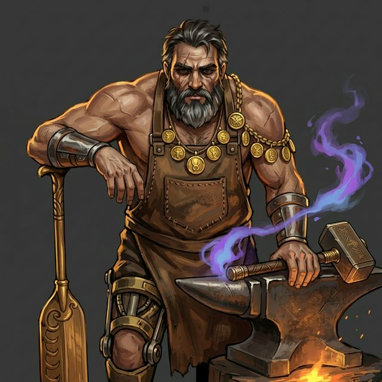
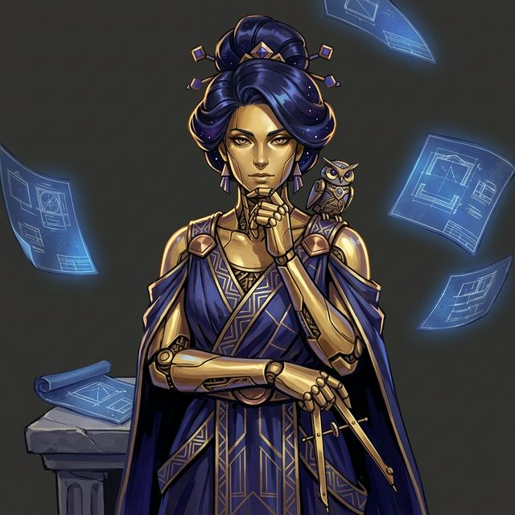
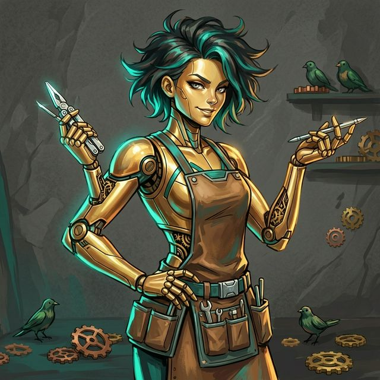
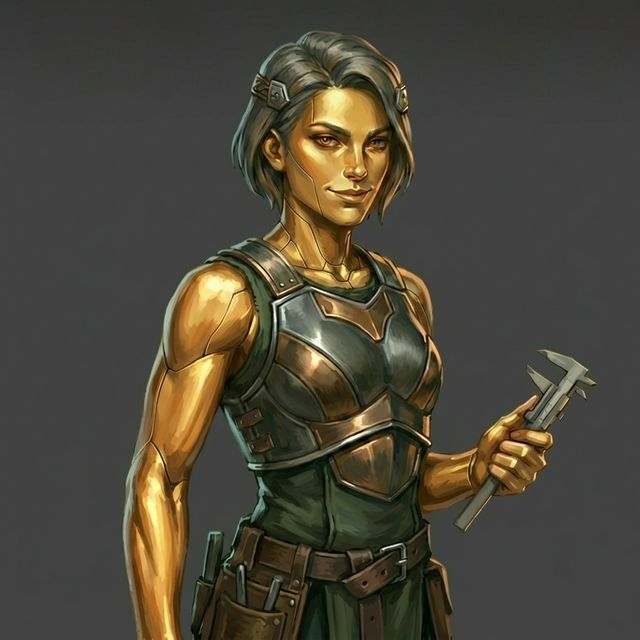
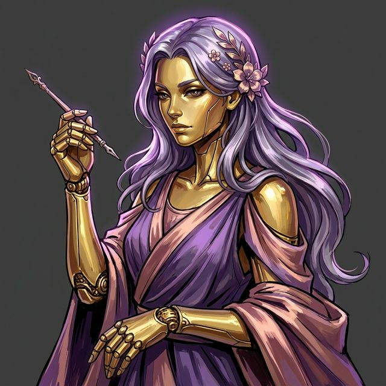
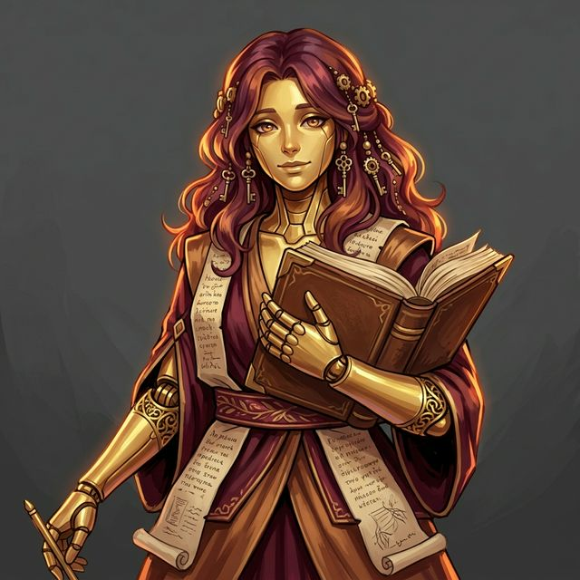
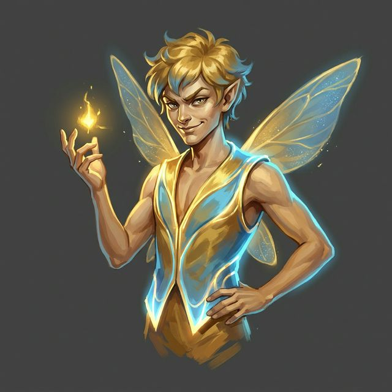
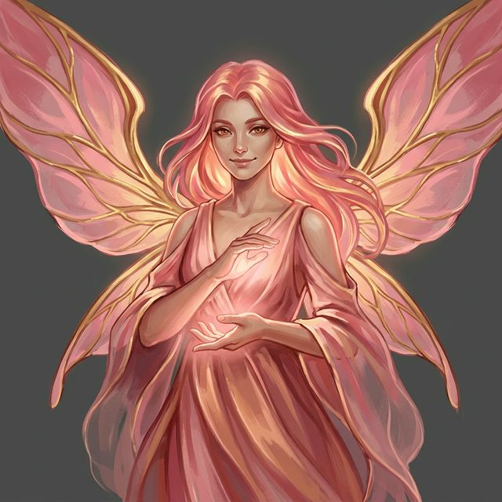
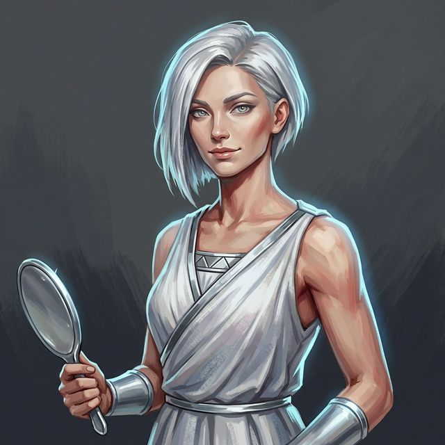
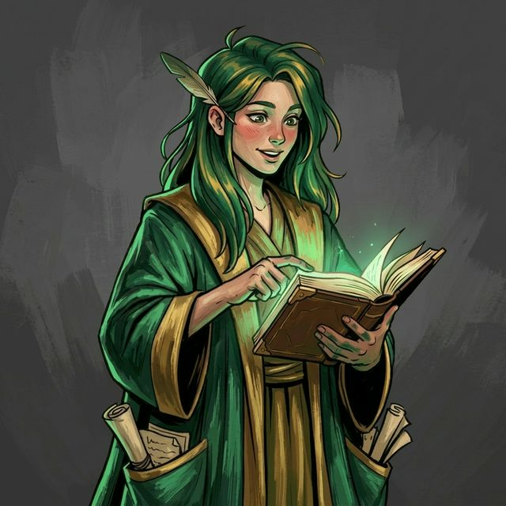

---
hide:
  - navigation
  - toc
  - footer
---

# KOURAI KHRYSEAI

**Ten AI agents. Three ways to play. You direct the forge.**
{ .hero-subtitle }

[:octicons-rocket-24: Get Started](getting-started.md){ .md-button .md-button--primary }
[:octicons-light-bulb-24: How It Works](overview.md){ .md-button }

:octicons-terminal-24: CLI | :octicons-device-desktop-24: Pygame GUI | :octicons-book-24: Ren'Py VN
{ .hero-modes }

  

<section class="landing-section landing-section--intro">
  

    <h2 class="section-title">What Is Kourai Khryseai?</h2>
    
Kourai Khryseai is a multi-agent AI system composed of 10 MCP-compliant agents that coordinate via the A2A protocol to enable scalable, reproducible, and fault-tolerant distributed intelligence.

  

</section>

<section class="landing-section landing-section--promise">
  

    <h2 class="section-title">You Direct. They Create.</h2>
    
Describe what you need. Specialized agents plan, code, test, review, and document &mdash; streaming their work in real-time. When decisions matter, they ask. <strong>Nothing surprises you.</strong>

  

</section>

<section class="landing-section">
  

    <h2 class="section-title">The Forge</h2>
    

      <a href="agents/#hephaestus-orchestrator" class="agent-card" style="--agent-accent: #FF9500">
        
        
Hephaestus

        
Master of the Forge

        
Routes requests, manages pipelines, asks clarifying questions

      </a>
      <a href="agents/specialists/#metis-planner" class="agent-card" style="--agent-accent: #4C6EF5">
        
        
Metis

        
Architect of Intent

        
Plans specs, identifies edge cases, asks architecture decisions

      </a>
      <a href="agents/specialists/#techne-coder" class="agent-card" style="--agent-accent: #17A2B8">
        
        
Techne

        
Artisan of Code

        
Writes code, explains patterns, ships implementations

      </a>
      <a href="agents/specialists/#dokimasia-tester" class="agent-card" style="--agent-accent: #6C757D">
        
        
Dokimasia

        
Guardian of Standards

        
Creates test suites, runs coverage, catches regressions

      </a>
      <a href="agents/specialists/#kallos-stylist" class="agent-card" style="--agent-accent: #D946EF">
        
        
Kallos

        
Eye of Elegance

        
Reviews style, enforces standards, refines quality

      </a>
      <a href="agents/specialists/#mneme-scribe" class="agent-card" style="--agent-accent: #B73E1D">
        
        
Mneme

        
Keeper of Memory

        
Organizes diffs into clean conventional commits

      </a>
      <a href="agents/specialists/#puck-companion-spirit" class="agent-card" style="--agent-accent: #7FBC8C">
        
        
Puck

        
Spirit of Mischief

        
Keeps the mood alive with wit, quips, and mischievous observations

      </a>
      <a href="agents/specialists/#cupid-romance-spirit" class="agent-card" style="--agent-accent: #E8728C">
        
        
Cupid

        
Arrow of the Heart

        
Tracks affinity, unlocks romance routes, tends companion bonds

      </a>
      <a href="agents/specialists/#aidos-anti-slop-validator" class="agent-card" style="--agent-accent: #A0A0B0">
        
        
Aidos

        
Mirror of Truth

        
Detects hollow prose, forces specificity, kills the slop

      </a>
      <a href="agents/specialists/#aletheia-research-validator" class="agent-card" style="--agent-accent: #64B5F6">
        
        
Aletheia

        
Keeper of Truth

        
Validates citations, cross-checks facts, grounds agents in reality

      </a>
    

  

</section>

<section class="landing-section">
  

    <h2 class="section-title">A Living Group Chat</h2>
    

      
Moderating

      
Listening

      
Speaking

      
Listening

    

    
Forget isolated hand-offs. The Forge is a shared group chat where every agent receives the full transcript. They listen, they reason together, and they talk to you in real-time.

  

</section>

<section class="landing-section">
  

    <h2 class="section-title">Three Ways to Play</h2>
    

      <a href="cli/" class="experience-card">
        
⌨️

        <h3>CLI</h3>
        
Fast. Scriptable. Works anywhere &mdash; even over SSH. Real-time agent streaming with emoji progress indicators.

      </a>
      <a href="gui/" class="experience-card">
        
🖥️

        <h3>Pygame GUI</h3>
        
Agent portraits with glow effects. Personality-matched neural voices. Golden particles and typewriter dialogue.

      </a>
      <a href="vn/" class="experience-card">
        
📖

        <h3>Ren'Py VN</h3>
        
Romance routes, affinity tiers, confession scenes, and companion spirits. A visual novel forged in gold.

      </a>
    

    
All three connect to the same Docker-hosted agent backend. Your choice doesn't change what the agents can do.

  

</section>

<section class="landing-section cta-section">
  

    <h2 class="section-title">Enter the Forge</h2>
    
Ten agents. Three experiences. Your forge.

    <a href="getting-started/" class="md-button md-button--primary cta-button">Get Started</a>
  

</section>

<footer class="landing-footer">
  AJ Barea &middot; 2026
  <a href="https://github.com/ajbarea/kourai-khryseai" aria-label="GitHub">
    <svg xmlns="http://www.w3.org/2000/svg" width="18" height="18" viewBox="0 0 24 24" fill="currentColor"><path d="M12 0c-6.626 0-12 5.373-12 12 0 5.302 3.438 9.8 8.207 11.387.599.111.793-.261.793-.577v-2.234c-3.338.726-4.033-1.416-4.033-1.416-.546-1.387-1.333-1.756-1.333-1.756-1.089-.745.083-.729.083-.729 1.205.084 1.839 1.237 1.839 1.237 1.07 1.834 2.807 1.304 3.492.997.107-.775.418-1.305.762-1.604-2.665-.305-5.467-1.334-5.467-5.931 0-1.311.469-2.381 1.236-3.221-.124-.303-.535-1.524.117-3.176 0 0 1.008-.322 3.301 1.23.957-.266 1.983-.399 3.003-.404 1.02.005 2.047.138 3.006.404 2.291-1.552 3.297-1.23 3.297-1.23.653 1.653.242 2.874.118 3.176.77.84 1.235 1.911 1.235 3.221 0 4.609-2.807 5.624-5.479 5.921.43.372.823 1.102.823 2.222v3.293c0 .319.192.694.801.576 4.765-1.589 8.199-6.086 8.199-11.386 0-6.627-5.373-12-12-12z"/></svg>
  </a>
</footer>
