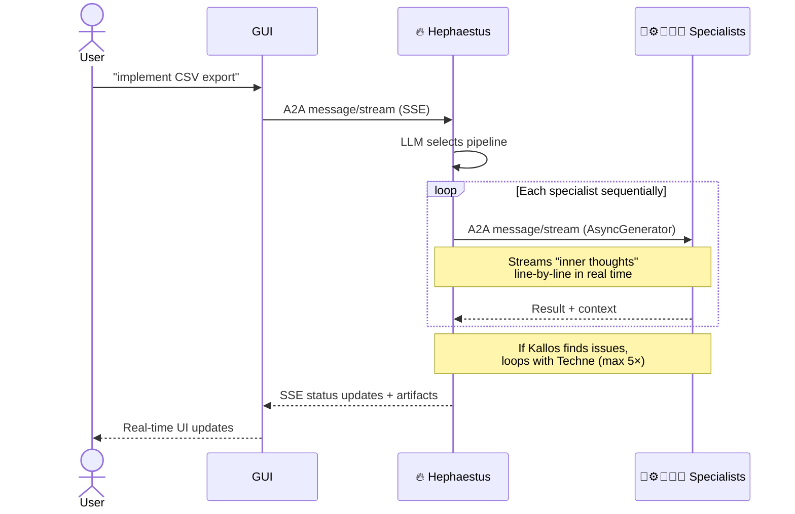

# Overview

## 🏛️ What is Kourai Khryseai?

Kourai Khryseai is a **multi-agent development system** where six AI specialists collaborate through the [A2A (Agent-to-Agent) protocol](https://a2a-protocol.org) to handle the full software development lifecycle — planning, coding, testing, linting, and commit prep.

You describe what you want in plain English. They build it.

```
╔══════════════════════════════════════════╗
║     Kourai Khryseai — Golden Maidens     ║
╚══════════════════════════════════════════╝
Type your request. Commands: :q (quit), :status (agent info)

kourai: implement CSV export with tests

🔥 Hephaestus: Routing to pipeline [metis, techne, dokimasia, kallos, mneme]
📐 Metis: [1/5] Spec complete — 12 implementation steps
⚙️ Techne: [2/5] Writing changes to 3 files...
🧪 Dokimasia: [3/5] 8/8 tests passed ✅
✨ Kallos: [4/5] ruff ✅ · comments ✅ · all clean
📜 Mneme: [5/5] Generated 2 commit groups

────────────────────────────────────────
feat(parser): add CSV export support
- Added parse_csv() function with streaming reader
- Integrated with existing data pipeline
Files: src/utils/parser.py, src/api/endpoints.py

test(parser): add CSV export test suite
- Added 8 unit tests covering edge cases
- Verified streaming behavior with large files
Files: tests/unit/test_parser.py
────────────────────────────────────────
```

---

## ⚡ Why This Exists

Most AI coding tools are single-agent — one model tries to do everything. That's fine for small edits, but falls apart on real development work where planning, implementation, testing, and code quality are distinct disciplines.

Kourai Khryseai splits the problem across **six specialist agents**, each focused on one thing:

| Agent | Specialty | Smart Tier Model |
|---|---|---|
| 🔥 **Hephaestus** | Orchestration — routes requests, manages pipelines | Claude Sonnet 4.6 |
| 📐 **Metis** | Planning — specs, acceptance criteria, edge cases | Claude Opus 4.6 |
| ⚙️ **Techne** | Coding — reads existing code, generates changes | Claude Sonnet 4.6 |
| 🧪 **Dokimasia** | Testing — writes and runs pytest suites | Claude Sonnet 4.6 |
| ✨ **Kallos** | Style — ruff linting, comment cleanup, docstrings | Claude Sonnet 4.6 |
| 📜 **Mneme** | Commits — conventional commit messages from diffs | Claude Sonnet 4.6 |

Models are assigned per agent via `KOURAI_MODEL_TIER` (`cheap`, `standard`, `smart`). The default `cheap` tier uses Haiku for all agents. See [Configuration → LLM Models](configuration.md#llm-models) for the full breakdown.

Each agent is an independent HTTP server. They communicate through the open [A2A protocol](https://a2a-protocol.org) — the same standard backed by Google, Salesforce, and the Linux Foundation for agent interoperability.

---

## 🔄 How a Request Flows

When you type a request into the CLI or GUI, here's what happens:



Hephaestus selects the pipeline automatically based on your request:

| You say | Pipeline |
|---------|----------|
| *"implement feature X"* | 📐 → ⚙️ → 🧪 → ✨ → 📜 |
| *"fix bug in X"* | ⚙️ → 🧪 → ✨ → 📜 |
| *"add tests for X"* | 🧪 → ✨ → 📜 |
| *"clean up X"* | ✨ → 📜 |
| *"commit prep"* | 📜 |
| *"plan feature X"* | 📐 |
| *"@techne why use a factory?"* | ⚙️ (Direct 1-on-1 Handoff) |

### Human-on-the-Loop (HOTL) UX
If a request is ambiguous, the system avoids generating thousands of wasted tokens. Instead, Hephaestus initiates an `INPUT_REQUIRED` loop and proactively presents **A/B multiple-choice options** to the user (e.g., "Option A is faster, Option B is more scalable. Which do you prefer?"). Furthermore, as agents draft specifications or code, they stream their "inner thoughts" directly to the UI, allowing you to interrupt and guide them early.

---

## 🔧 Built With

<div class="grid cards" markdown>

-   :material-api:{ .lg .middle } **Protocol**

    ---

    [A2A 0.3.x](https://a2a-protocol.org) — open agent-to-agent communication standard

-   :material-language-python:{ .lg .middle } **Language**

    ---

    Python 3.12+ · modern type hints · Google docstrings

-   :material-brain:{ .lg .middle } **LLM**

    ---

    [LiteLLM](https://docs.litellm.ai/) — Claude in production, Ollama for free local dev

-   :material-server:{ .lg .middle } **Server**

    ---

    [Starlette](https://www.starlette.io/) + uvicorn via `a2a-sdk`

-   :material-magnify:{ .lg .middle } **Observability**

    ---

    [OpenTelemetry](https://opentelemetry.io/) → [Jaeger](https://www.jaegertracing.io/)

-   :material-docker:{ .lg .middle } **Containers**

    ---

    Docker + Docker Compose · optional Terraform for cloud

-   :material-package-variant:{ .lg .middle } **Packaging**

    ---

    [uv](https://docs.astral.sh/uv/) workspaces

-   :material-book-open-variant:{ .lg .middle } **Docs**

    ---

    [Zensical](https://zensical.dev)

</div>

---

## 🏛️ The Name

> *In Greek mythology, Hephaestus — god of fire and forge — crafted the Κοῦραι Χρύσεαι (Golden Maidens), woman-shaped automatons of living gold who served as intelligent attendants in his divine workshop. Each could think, speak, and work independently.*

Each agent is named after a Greek concept matching its role:

- **Hephaestus** — the divine craftsman, master of the forge
- **Metis** — wisdom and counsel (mother of Athena)
- **Techne** — art, craft, and skill
- **Dokimasia** — scrutiny and examination
- **Kallos** — beauty and elegance
- **Mneme** — memory (one of the original three Muses)
