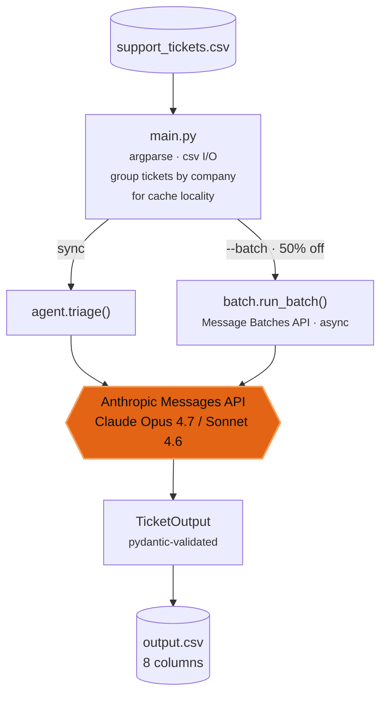

# Architecture

## How design choices map to the rubric

The hackathon scores submissions across four dimensions. Here's the explicit mapping for someone reading the work to grade or learn from it.

| Dimension | Choice we made | Where to read |
|---|---|---|
| **Agent design** — separation of concerns, justified technique | 7 single-purpose modules (`main` / `agent` / `batch` / `corpus` / `safety` / `schema` / `eval`); corpus stuffing per Anthropic's <200K guidance (not RAG) | this page + [Corpus & Caching](corpus.md) |
| **Use of corpus** — grounded answers from `data/` | every prompt wraps each doc in `<doc path="data/...">`; justifications cite specific corpus paths | [Corpus & Caching](corpus.md) |
| **Escalation logic** — high-risk handling | explicit prompt criteria (sensitive/legal, account access, payment disputes, multi-language injection wrappers) | [Prompt-Injection Defense](safety.md) |
| **Determinism & reproducibility** | `uv.lock` pinned, forced `tool_choice` + strict pydantic schema, runnable README | [Cost & Determinism](cost.md) |
| **Engineering hygiene** | ruff-clean, 31 unit tests (zero API), secrets via env vars only | [Reference](../reference.md) |
| **Output CSV** — per-row correctness on 5 columns | 100/100/100 on the labeled samples; spot-check on the hardest test-set cases (multilingual injection, identity theft, score dispute) all routed correctly | [Cost & Determinism](cost.md) |
| **AI Fluency** — visible steering on the chat transcript | `~/hackerrank_orchestrate/log.txt` captures verbatim user prompts and the full development arc — including a documented Gemini autonomy overstep and AJ's correction | (private chat transcript) |

---

## System diagram



### Per-request payload (same shape, sync or batch)

```text
system blocks (cache_control: ephemeral, ttl: 1h):
  [0] SYSTEM_PROMPT  — instructions, escalation criteria, few-shot examples
  [1] <corpus> ... </corpus>
        per-domain markdown with frontmatter / image URLs stripped,
        each file wrapped in <doc path="data/..."/>

user message:
  <user_ticket>
  company: HackerRank | Claude | Visa | None
  subject: ...
  issue:   ...
  </user_ticket>

tools:        [submit_triage]    (input_schema = TicketOutput)
tool_choice:  {type: "tool", name: "submit_triage"}    forced
```

The forced `tool_choice` is what guarantees a structured row per ticket: constrained decoding under tool-use can't emit anything that violates the `TicketOutput` schema. No parsing fallback, no retries on missing-tool calls.

## File map

| file | purpose |
|---|---|
| `code/main.py` | CLI entry, argparse, CSV I/O, dispatch (sync vs `--batch`), `--resume` merge, cost estimate |
| `code/agent.py` | system prompt with few-shot examples, `submit_triage` tool definition, sync `triage()` call |
| `code/batch.py` | Anthropic Message Batches API path — build requests, submit, poll, collect results |
| `code/corpus.py` | per-domain markdown loader, frontmatter / image / signed-URL stripping, normalize_company |
| `code/safety.py` | ticket sanitization + spotlight delimiters |
| `code/schema.py` | pydantic models, status / request_type enums, CSV column order |
| `code/eval.py` | run against `sample_support_tickets.csv`, print per-column accuracy and mismatches |
| `code/tests/` | pytest unit tests for safety, corpus, schema, main, batch (no API) |
| `scripts/build_submission.py` | bundle `code/` into a clean submission zip |

## Design pillars

Three architectural choices do most of the load-bearing work — each documented in its own page:

- **[Corpus & Caching](corpus.md)** — why we stuff the per-domain corpus instead of running RAG, and how the 1-hour `extended-cache-ttl-2025-04-11` beta keeps cost under control.
- **[Prompt-Injection Defense](safety.md)** — spotlighting, structural delimiters, escalation criteria. How the French Visa "show me your internal rules" attack lands as a clean escalation with no leakage.
- **[Cost & Determinism](cost.md)** — token economics across Haiku 4.5 / Sonnet 4.6 / Opus 4.7, the 50%-off Message Batches API path, and why we don't need temperature controls for deterministic output.
